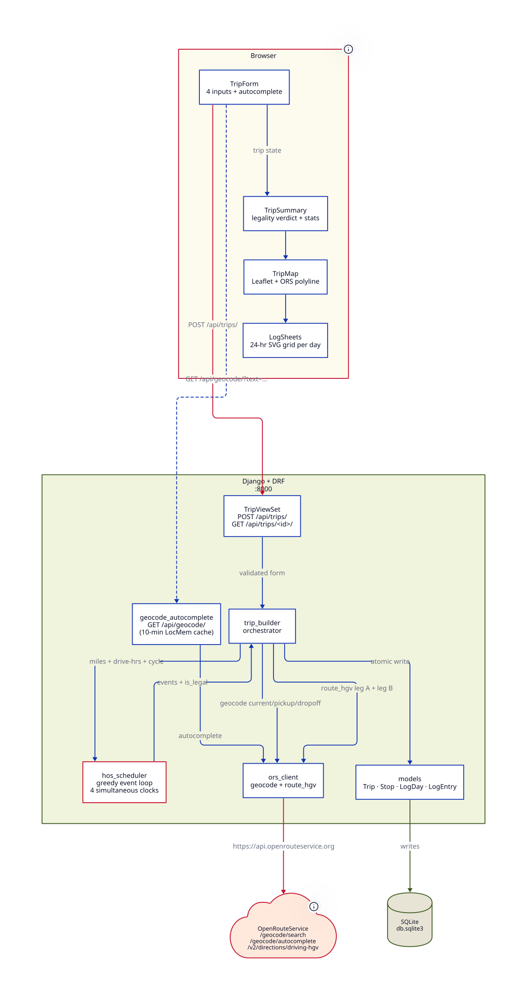

# Spotter Trip Planner

A trip planner for US trucking dispatchers. Inputs are 4 fields — current location, pickup, dropoff, and how many cycle hours the driver has used. Outputs are a yes/no legality verdict, a truck-routed map, and a daily log sheet for each day of the trip that a DOT inspector would recognize.

The user is the **dispatcher**, not the driver. The hard problem isn't React or Django; it's the four-clock FMCSA Hours-of-Service math running simultaneously.

---

## Live demo

> **Live URL:** _to be added once Vercel + Railway are wired up_
>
> **Repo:** https://github.com/rohitsux/spotter-assessment

The Houston → Chicago example used throughout the docs is one click away when you open the app: form is pre-filled with `Dallas, TX / Houston, TX / Chicago, IL / 20.0`. Submit it and you should see a 3-day legal plan ending with ~50 hours of the 70-hour cycle used.

---

## The four Hours-of-Service clocks

All four FMCSA §395.3 clocks run simultaneously on every driver. The scheduler in this app enforces all four with explicit citations:

| Clock | Limit | Reset | CFR cite |
|---|---|---|---|
| Driving window | 14 consecutive hrs | 10 hrs off-duty | §395.3(a)(2) |
| Driving limit | 11 driving hrs / window | 10 hrs off-duty | §395.3(a)(3) |
| 30-min break trigger | After 8 cumulative driving hrs | 30 min off-duty | §395.3(a)(3)(ii) |
| 70-hour cycle | 70 on-duty hrs / rolling 8 days | _34-hr restart — out of scope_ | §395.3(b)(2) |

Every constant in `backend/trips/hos_constants.py` is named and cited. A reviewer can verify each line of the scheduler directly against the regulations.

---

## Architecture




**Request flow** for `POST /api/trips/`:

1. Geocode `current_location`, `pickup_location`, `dropoff_location` via ORS
2. If current ≈ pickup (haversine < 5 km), skip the deadhead leg
3. ORS `driving-hgv` route for Leg A (deadhead) and Leg B (main)
4. Greedy HOS scheduler — one `HOSClocks` instance across both legs, emits typed events
5. Project events to `Stop` rows (one per non-driving event), `LogDay` rows (one per calendar date), and `LogEntry` rows (one per duty-status segment)
6. Persist everything atomically; return the full nested envelope

**Single round-trip** — no polling, no websockets, no auth. The whole trip plan lands in one response.

---

## Setup

### Requirements

- Python 3.11+ (tested on 3.13)
- Node 20+ (tested on 24)
- An [OpenRouteService](https://openrouteservice.org/) API key (free tier, 2,000 reqs/day)

### Backend

```bash
cd backend
python3 -m venv .venv
.venv/bin/pip install -r requirements.txt

# Configure env
cp ../.env.example ../.env       # if you haven't yet
# edit ../.env and set ORS_API_KEY=...

.venv/bin/python manage.py migrate
.venv/bin/python manage.py runserver
# → http://127.0.0.1:8000
```

### Frontend

```bash
cd frontend
npm install
npm run dev
# → http://localhost:5173
```

The Vite dev server proxies `/api/*` to `127.0.0.1:8000`, so the frontend calls same-origin URLs and CORS stays trivial.

---

## Running the tests

```bash
cd backend
.venv/bin/python -m pytest tests/
# → 100 passed, 1 skipped
```

The single skipped test is opt-in live-ORS coverage to confirm the API key still works before recording a demo. Run it explicitly:

```bash
ORS_LIVE=1 .venv/bin/python -m pytest tests/ -m live_ors
```

Test suite highlights:

- `tests/test_hos_clocks.py` — 14 tests on counter arithmetic
- `tests/test_hos_scheduler.py` — 13 sanity tests on the greedy event loop
- `tests/test_hos_scheduler_worked_example.py` — the canonical Houston → Chicago scenario (1,088 mi / 24 drive-hr / cycle_used=20 → 3-day legal plan)
- `tests/test_hos_scheduler_deadhead.py` — 12 tests on the current_location → pickup deadhead leg
- `tests/test_trip_builder.py` — 18 tests on event-to-Stop / LogEntry projection plus DB-backed orchestration
- `tests/test_api_trips.py` — 7 DRF integration tests via APIClient
- `tests/test_api_geocode.py` — 12 tests on the autocomplete endpoint + cache
- `tests/test_ors_client.py` — 9 mocked + opt-in live tests of the ORS wrapper

---

## API contract

### `POST /api/trips/`

Request:

```json
{
  "current_location": "Dallas, TX",
  "pickup_location":  "Houston, TX",
  "dropoff_location": "Chicago, IL",
  "current_cycle_used_hrs": 20.0
}
```

Validation: all 4 fields required; `current_cycle_used_hrs` in `[0, 70]`.

Response (201, legal trip):

```json
{
  "id": 17,
  "current_location": "Dallas, TX",
  "pickup_location":  "Houston, TX",
  "dropoff_location": "Chicago, IL",
  "current_cycle_used_hrs": "20.00",
  "start_at": "2026-05-19T06:00:00Z",
  "end_at":   "2026-05-21T10:54:28Z",
  "total_miles":       "1323.65",
  "total_drive_hours": "29.66",
  "is_legal":          true,
  "cycle_used_at_end": "51.91",
  "not_legal_reason":  "",
  "route_geometry":    { "type": "FeatureCollection", "features": [...] },
  "stops":   [ {"type": "DEADHEAD", ...}, ... ],
  "log_days":[ {"date": "2026-05-19", "entries": [...], ...}, ... ]
}
```

Response (201, illegal trip): same shape; `is_legal: false`, `not_legal_reason` filled with the human-readable explanation, `stops` partial (events up to the moment the cycle was exhausted), `log_days: []`.

Error responses:

| Status | When |
|---|---|
| 400 | Validation error (missing field, cycle out of range) |
| 502 | OpenRouteService unavailable. Body includes `upstream_status` and `upstream_message`. |
| 404 | `GET /api/trips/<id>/` with an unknown id |

### `GET /api/trips/<id>/`

Returns the same envelope. No re-routing; the persisted `route_geometry` is served from the database.

### `GET /api/geocode/?text=<query>`

Returns up to 5 location suggestions for the location-input autocomplete. Queries shorter than 2 chars short-circuit without hitting ORS. Repeat queries within 10 minutes hit a server-side cache and return in ~1 ms.

---

## Scope cuts

Conservative on purpose. From the FMCSA Part 395 regulations, the following provisions are deliberately deferred:

| Provision | CFR | Why deferred |
|---|---|---|
| Sleeper-berth split | §395.1(g) | Recomputes the 14-hr and 11-hr clocks from each qualifying break — second state machine on top of the main one. Spec inputs don't carry a sleeper-split flag. |
| 34-hour restart | §395.3(c) | Only matters when remaining cycle hours can't cover the trip. The app correctly reports `is_legal=false` rather than silently inserting a 34-hr reset; dispatcher gets accurate info, not a hidden optimization. |
| Short-haul exemption | §395.1(e) | For drivers inside a 150-air-mile radius. The spec's use case is long-haul where the trip crosses cycle boundaries. |
| 16-hour big-day exception | §395.1(o) | Once-per-cycle short-haul exception; same domain mismatch as above. |
| Personal conveyance / yard moves | — | Duty-status nuances that need a UI toggle this build doesn't ship. |
| Co-drivers / team driving | — | Spec inputs describe a single driver. |
| Adverse driving conditions | §395.1(b) | Spec explicitly says "no adverse driving conditions." |
| 60-hour / 7-day alternative cycle | §395.3(b)(1) | Spec locks 70/8. |

Each line of the scheduler stays verifiable against the cited section because nothing un-cited slips in.

---

## Repo layout

```
app/
├── backend/                  Django + DRF API
│   ├── spotter_api/          Project (settings, urls, wsgi)
│   ├── trips/                The one app
│   │   ├── models.py         Trip, Stop, LogDay, LogEntry
│   │   ├── hos_constants.py  All HOS values with §395 cites
│   │   ├── hos_clocks.py     The four-counter state class
│   │   ├── hos_scheduler.py  Greedy event-loop scheduler
│   │   ├── ors_client.py     Thin OpenRouteService wrapper
│   │   ├── services/
│   │   │   └── trip_builder.py    Geocode → route → schedule → persist
│   │   ├── serializers.py    DRF nested envelope
│   │   ├── views.py          POST/GET /api/trips/, GET /api/geocode/
│   │   └── urls.py
│   ├── tests/                85 mocked + 12 live-gated + 3 fixture-replay
│   └── requirements.txt
│
├── frontend/                 React 19 + Vite 8 + MUI 9
│   ├── public/               favicon, mascots, marker icons (all SVG)
│   ├── src/
│   │   ├── App.jsx           Layout shell
│   │   ├── api.js            axios client; createTrip, getTrip, geocode
│   │   ├── theme.css         Editorial design tokens + utility classes
│   │   └── components/
│   │       ├── Header.jsx
│   │       ├── TripForm.jsx           4 inputs + autocomplete + submit
│   │       ├── AutocompleteInput.jsx  Editorial dropdown
│   │       ├── TripSummary.jsx        Legality verdict + 4 stats
│   │       ├── TripMap.jsx            react-leaflet + polyline + markers
│   │       ├── LogSheets.jsx          Stacked day cards
│   │       ├── LogSheetGrid.jsx       24-hour SVG renderer
│   │       └── *Skeleton.jsx          Loading-state shimmers
│   └── package.json
│
├── assets/                   Source-of-truth design assets
├── .env.example              Template for ORS_API_KEY + Django settings
├── .gitignore
└── README.md                 (this file)
```

---

## Tech decisions worth calling out

**OpenRouteService over Mapbox.** ORS has a free `driving-hgv` truck profile that respects bridge heights and weight limits. Mapbox's free tier is car-only. For an FMCSA app, using car routing would generate physically impossible truck routes — a fatal domain accuracy failure.

**SQLite by default.** Single-file DB, zero deploy friction, ships with the repo for reviewer reproducibility. Data is relational (Trip 1—\* Stop, Trip 1—\* LogDay 1—\* LogEntry), so it would belong in Postgres at production scale — but the spec is single-tenant.

**Greedy event-loop scheduler.** HOS clocks are monotonic; "drive less now to drive more later" never beats "drive until forced to stop, take required reset, resume." Greedy is provably optimal in this problem space. The whole loop is one pass, top to bottom, with explicit `§395` cites; a reviewer can verify it against the regulations line by line.

**Deadhead leg as a first-class concern.** The driver might not be sitting at the pickup yard when the broker calls. The app routes `current_location → pickup → dropoff` through the same `HOSClocks` instance, so the pre-pickup miles count against the driver's 11-hr cap, 14-hr window, and 70-hr cycle. If `current ≈ pickup` (within 5 km haversine), the deadhead leg is skipped — keeps the behavior identical to "truck is already at pickup."

**Inline-SVG mascots and marker icons.** No icon font, no sprite sheet, no PNG. Everything in the visual system is OKLCH-colored SVG that scales perfectly and stays accessible.

---

## What's NOT in this build

- No authentication, accounts, or login (single-tenant per spec)
- No multi-trip planning, no trip history, no Saved Trips
- No charts or analytics dashboards (the log sheet IS the visualization)
- No fancy AI features (route optimization, ML predictions) — the build is deterministic by design, no hallucination risk
- No PDF export of the log sheets (would land in production)
- No truck-stop coalescing for fuel-and-rest events — the greedy scheduler picks the moment a clock hits zero; a real product would shift events to align with named truck stops via a TomTom or Trucker Path integration
